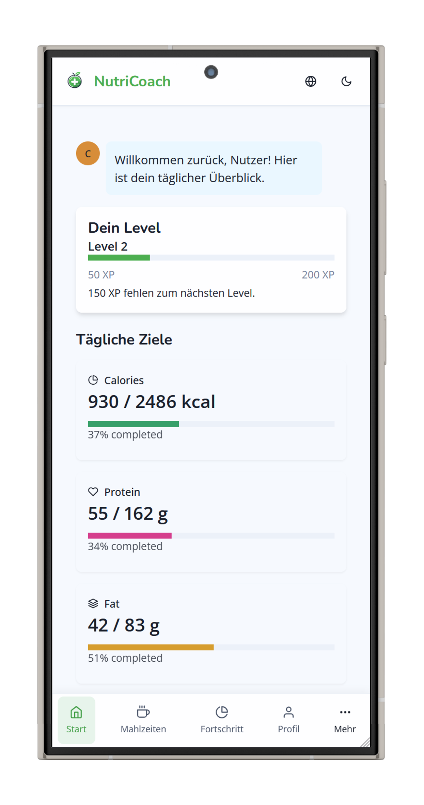

# 🥗 NutriCoach - Dein persönlicher Ernährungscoach

NutriCoach ist eine moderne Web-Anwendung, die dir hilft, deine Ernährung und Fitness im Blick zu behalten. Mit einem benutzerfreundlichen Interface und umfangreichen Funktionen unterstützt dich NutriCoach dabei, deine Gesundheitsziele zu erreichen.



## ✨ Features

- **📱 Modernes, responsives Design** mit Chakra UI
- **🌍 Mehrsprachig** (Deutsch/Englisch) dank i18next
- **📊 Umfangreiches Tracking:**
  - Mahlzeiten und Kalorien
  - Wasseraufnahme
  - Gewichtsverlauf
  - Nährwerte (Proteine, Kohlenhydrate, Fette)
  
- **🍳 Rezeptverwaltung:**
  - Über 30 vorinstallierte, gesunde Rezepte
  - Möglichkeit, eigene Rezepte zu erstellen
  - Detaillierte Nährwertangaben
  - Kategorisierung und Suchfunktion
  
- **👤 Personalisierung:**
  - Individuelles Onboarding
  - Persönliche Ziele setzen
  - Anpassbare Ernährungspläne
  
- **📈 Fortschrittsüberwachung:**
  - Detaillierte Statistiken
  - Visuelle Fortschrittsanzeigen
  - Tägliche, wöchentliche und monatliche Übersichten

## 🚀 Technologie-Stack

- **Frontend:** React 18 mit TypeScript
- **UI Framework:** Chakra UI
- **State Management:** React Context API
- **Routing:** React Router v6
- **Internationalisierung:** i18next
- **Diagramme:** Chart.js & Recharts
- **Animationen:** Framer Motion
- **Entwicklungswerkzeuge:** 
  - Create React App
  - ESLint
  - TypeScript
  - Git

## 🛠️ Installation

1. Repository klonen:
   ```bash
   git clone https://github.com/nolosi/nutricoach-react.git
   ```

2. In das Projektverzeichnis wechseln:
   ```bash
   cd nutricoach-react
   ```

3. Abhängigkeiten installieren:
   ```bash
   npm install
   ```

4. Entwicklungsserver starten:
   ```bash
   npm start
   ```

Die Anwendung ist dann unter [http://localhost:3000](http://localhost:3000) erreichbar.

## 📁 Projektstruktur

```
src/
├── components/     # Wiederverwendbare UI-Komponenten
├── contexts/       # React Context für State Management
├── pages/         # Hauptseiten der Anwendung
├── services/      # Dienste für Datenverarbeitung
├── utils/         # Hilfsfunktionen
├── types/         # TypeScript Definitionen
├── i18n/          # Übersetzungen
└── theme/         # Chakra UI Theme Anpassungen
```

## 🔄 Continuous Integration/Deployment

- Automatische Deployments auf Netlify
- Kontinuierliche Integration mit GitHub Actions
- Automatische Vorschau-Deployments für Pull Requests

## 🤝 Mitwirken

Beiträge sind willkommen! Bitte beachte:

1. Fork das Repository
2. Erstelle einen Feature Branch (`git checkout -b feature/AmazingFeature`)
3. Committe deine Änderungen (`git commit -m 'Add some AmazingFeature'`)
4. Push zum Branch (`git push origin feature/AmazingFeature`)
5. Öffne einen Pull Request

## 📝 Lizenz

Dieses Projekt ist unter der MIT Lizenz lizenziert - siehe die [LICENSE](LICENSE) Datei für Details.

## 🙏 Danksagung

- Alle verwendeten Icons stammen von [React Icons](https://react-icons.github.io/react-icons/)
- Rezeptbilder von [Unsplash](https://unsplash.com)
- UI-Komponenten basierend auf [Chakra UI](https://chakra-ui.com)

---

Entwickelt mit ❤️ von [nolosi](https://github.com/nolosi) 